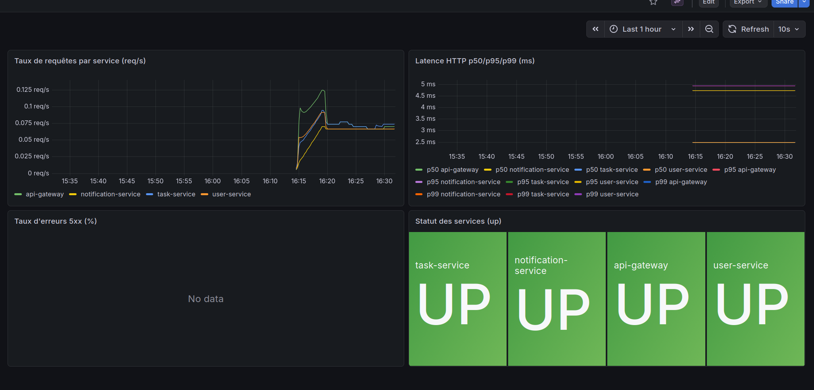
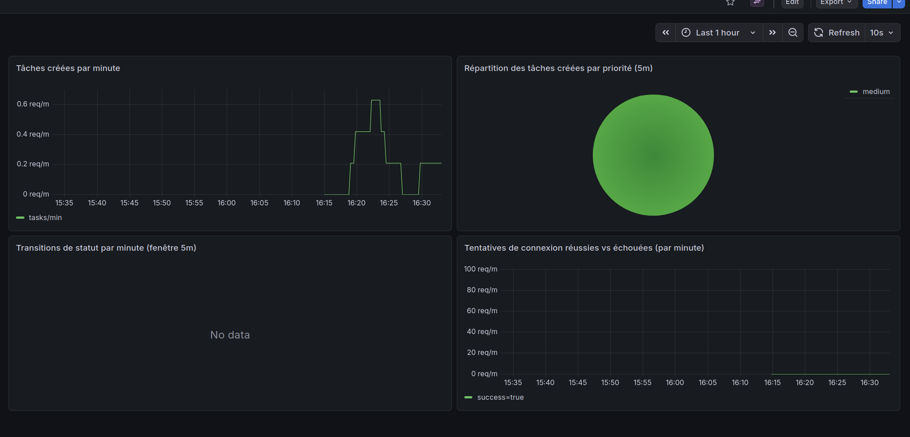
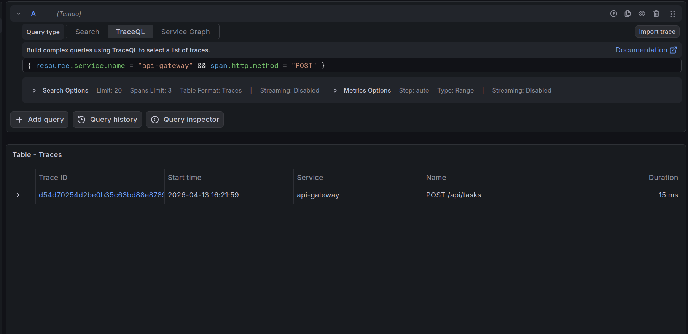
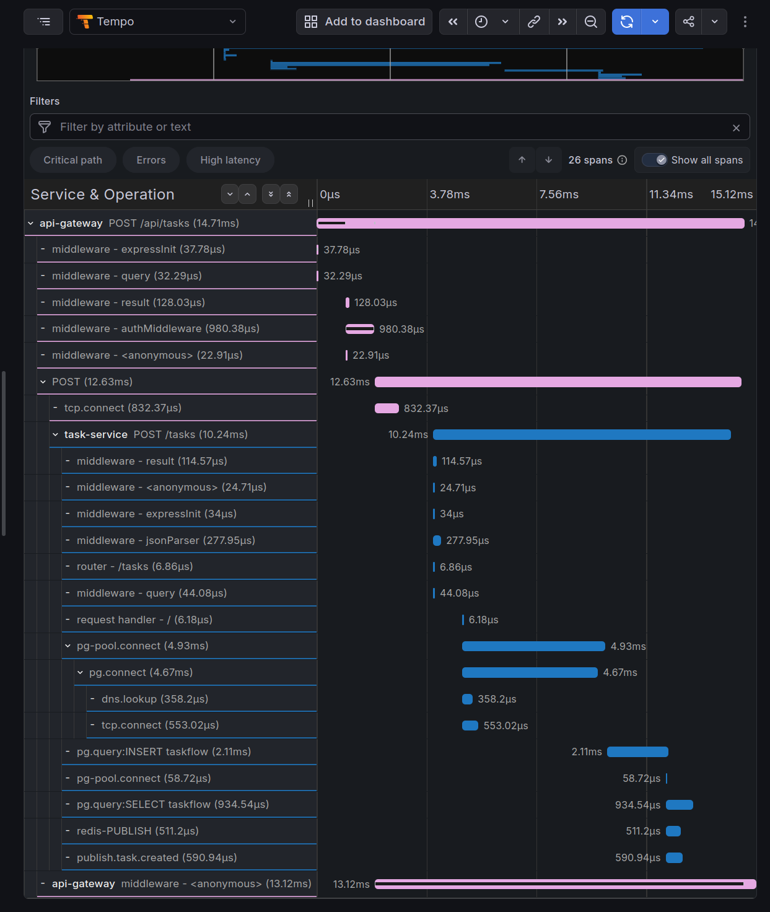
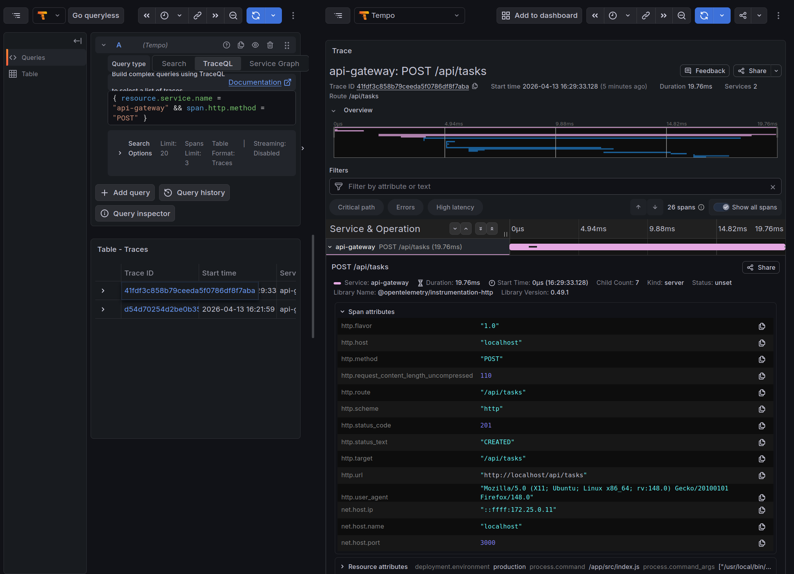
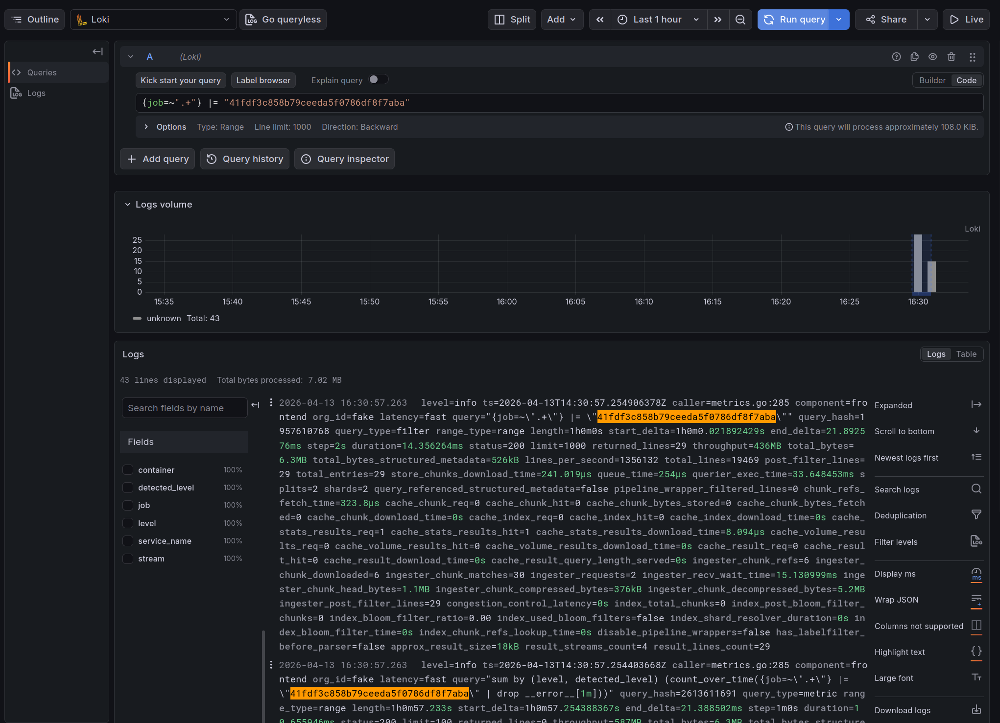

# REPORT — TaskFlow TP Cloud & DevOps

## A. Instrumentation

Chaque service Node.js est instrumenté via un fichier `tracing.js` chargé en première ligne de `index.js` avec `require('./tracing')`. Il initialise le SDK OpenTelemetry avec :
- Une **ressource** identifiant le service (`service.name`, `service.version`, `deployment.environment`)
- Un **exporter de traces** OTLP HTTP vers l'OTel Collector (`http://otel-collector:4318/v1/traces`)
- Un **exporter de métriques** OTLP HTTP avec export périodique toutes les 5 secondes
- Les **auto-instrumentations** Express, HTTP et PG (PostgreSQL)
- Un handler de **shutdown propre** sur SIGTERM/SIGINT pour vider le buffer avant arrêt

Les métriques métier ajoutées dans `metrics.js` de chaque service :

| Service | Métriques |
|---|---|
| task-service | `tasks_created_total` (label: priority), `tasks_status_changes_total` (labels: from_status, to_status), `tasks_gauge` (label: status) |
| user-service | `user_registrations_total`, `user_login_attempts_total` (label: success) |
| api-gateway | `upstream_errors_total` (label: service) |
| notification-service | `notifications_sent_total` (label: event_type) |

---

## B. Dashboards Grafana

### Vue d'ensemble des services



- **Taux de requêtes par service** — on voit le trafic en req/s sur api-gateway, task-service, user-service et notification-service
- **Latence HTTP p50/p95/p99** — histogramme permettant de détecter des dégradations. Ici la latence p99 dépasse 4ms sur certains services au moment des tests
- **Taux d'erreurs 5xx** — vide pendant les tests normaux, s'allume dès qu'une erreur est provoquée
- **Statut des services** — tous les 4 services affichés **UP** en vert

### Métriques métier



- **Tâches créées par minute** — pic visible lors de la création de tâches en rafale pendant les tests
- **Répartition par priorité** — pie chart : toutes les tâches créées avaient la priorité `medium`
- **Transitions de statut** — no data car aucun changement de statut n'a été effectué pendant la session de test
- **Tentatives de connexion** — `success=true` visible lors du login, axe gradué jusqu'à 100 req/m

---

## B. Traces distribuées

### Scénario testé

Création d'une tâche via POST `/api/tasks` depuis le frontend.

### Recherche dans Grafana / Tempo

```traceql
{ resource.service.name = "api-gateway" && span.http.method = "POST" }
```



### Chaîne de spans observée



```
api-gateway: POST /api/tasks (14.71ms)
  ├── middleware (expressInit, query, result, authMiddleware, <anonymous>)
  ├── POST → tcp.connect (vers task-service:3002)
  └── task-service: POST /tasks (10.24ms)
       ├── middleware (expressInit, query, jsonParser, <anonymous>, router)
       ├── pg-pool.connect → pg.connect → tcp.connect → dns.lookup
       ├── pg.query:INSERT taskflow (2.11ms) — création de la tâche
       ├── pg-pool.connect → pg.query:SELECT taskflow (934µs) — rechargement gauge
       ├── publish.task.created (590µs) — span custom
       │    └── redis-PUBLISH task.created (511µs)
```

### Attributs importants commentés



| Span | Attribut | Valeur | Signification |
|---|---|---|---|
| `api-gateway` | `http.method` | `POST` | Méthode HTTP de la requête entrante |
| `api-gateway` | `http.route` | `/api/tasks` | Route instrumentée côté gateway |
| `api-gateway` | `http.status_code` | `201` | La tâche a bien été créée |
| `api-gateway` | `http.flavor` | `1.0` | Version HTTP entre le client et le gateway |
| `task-service` | `http.route` | `/tasks` | Route interne du service |
| `pg.query:INSERT` | `db.system` | `postgresql` | Système de base de données |
| `pg.query:INSERT` | `db.statement` | `INSERT INTO tasks...` | Requête SQL exécutée (auto-instrumentée par le plugin PG) |
| `publish.task.created` | `messaging.system` | `redis` | Span custom — identifie Redis comme système de messaging |
| `publish.task.created` | `messaging.destination` | `task.created` | Canal Redis sur lequel l'événement est publié |

Le span `publish.task.created` a été ajouté **manuellement** car Redis n'est pas couvert par les auto-instrumentations. Il permet de voir dans le waterfall que la publication Redis se fait bien après l'INSERT en base, et mesure son temps d'exécution (590µs ici).

---

## C. Logs (Loki)

Promtail collecte les logs de tous les containers via l'API Docker socket. Il parse le JSON Pino et convertit les niveaux numériques en strings lisibles (`30→info`, `40→warn`, `50→error`), ce qui permet d'écrire des filtres LogQL comme `level="error"`.

### Requêtes LogQL utilisées

Logs du task-service uniquement :
```logql
{job=~".*task-service.*"}
```

Erreurs sur tous les services :
```logql
{job=~".+"} | json | level="error"
```

Requêtes ayant retourné un 500 :
```logql
{job=~".+"} | json | statusCode >= 500
```

Une erreur a été provoquée en envoyant un POST sans body via curl :
```bash
curl -X POST http://localhost:3002/tasks -H "Content-Type: application/json" -d '{}'
```
Le log d'erreur est apparu immédiatement dans Loki avec `level="error"`.

### LogQL vs PromQL

- **PromQL** — travaille sur des séries temporelles agrégées. `http_requests_total{status="500"}` donne un compteur mais pas de contexte sur ce qui s'est passé. Adapté pour détecter et quantifier un problème.
- **LogQL** — travaille sur les lignes de log brutes. On voit le message d'erreur exact, la stack trace, les paramètres de la requête. Indispensable pour comprendre *pourquoi* une erreur s'est produite.

Pour compter les 500 dans le temps, Prometheus est plus adapté (données déjà agrégées, requêtes rapides). Pour savoir ce qui a planté et lire le message d'erreur, Loki est indispensable.

### Corrélation trace ↔ log



Trace ID récupérée dans Tempo : `41fdf3c858b79ceeda5f0786df8f7aba`

Requête Loki :
```logql
{job=~".+"} |= "41fdf3c858b79ceeda5f0786df8f7aba"
```

**Résultat : 29 lignes** — on retrouve les logs Pino de l'api-gateway et du task-service correspondant exactement à cette requête, avec le même `trace_id` dans les champs JSON.

Pour le moment la corrélation est manuelle (copier-coller du traceId). Pour qu'elle soit automatique avec un lien cliquable depuis Tempo vers Loki, il faudrait configurer un **Derived field** dans la datasource Tempo qui détecte les traceIds et génère un lien vers une requête Loki pré-remplie.

### Démarche d'investigation en cas de pic d'erreurs

```
1. MÉTRIQUES (Prometheus / Dashboard)
   → Détecter : rate(http_requests_total{status=~"5.."}[5m])
   → On identifie quel service est touché et à quelle heure

2. LOGS (Loki)
   → Comprendre : {job="task-service"} | json | level="error"
   → On lit le message d'erreur exact (ex: "Cannot connect to database")

3. TRACES (Tempo)
   → Localiser : { resource.service.name = "task-service" && status = error }
   → On voit le waterfall complet et quel appel a échoué
     (DB timeout ? Redis unreachable ? Service downstream en erreur ?)
```

Cette approche en entonnoir — métriques → logs → traces — permet d'aller du général au particulier sans chercher une aiguille dans une botte de foin.
